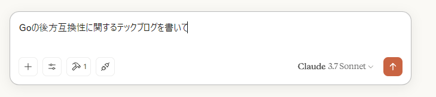
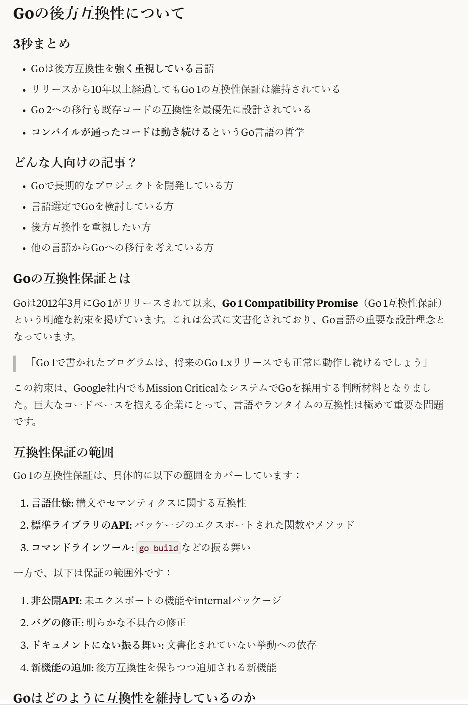

## 使い方

### MCPサーバーの追加
ex. claude desktopから利用する際は以下を参考に。
その他、MCPに対応したアプリケーションの場合は、各アプリケーションのドキュメントを参照し、jsonを構成してください。

https://modelcontextprotocol.io/quickstart/user

`command` の部分は実行するファイルのパスを指定してください。
事前ビルドした実行ファイルはレポジトリの `./bin` 以下にあります。

```json
{
    "mcpServers": {
        "writing-style": {
            "command": "./main.exe"
        }
    }
}

```

自分でビルドする場合は、`go build -o output_path` でビルドしてください。
goの実行環境が必要です。

## 実行サンプル
`Goの後方互換性に関するテックブログを書いて`  



一部抜粋  


フルサンプル: 
https://claude.site/artifacts/625ff5be-4cff-454e-928c-1c5516d2714b

## ヒント
ツールを使ってくれない時は、明示的に「writing-styleツールを使って」とするとうまくいきます。
追加しているMCPサーバーが多い場合、使ってくれないことがあるようです。
